# Bite Tracker

## Restaurant Visit & Review Manager

**🌐 [Live Demo on Heroku](https://bite-tracker-2800389c963c.herokuapp.com/)** | **📁 [GitHub Repository](https://github.com/crucioltheresa/bite-tracker)**

A professional CLI application for tracking restaurant visits and reviews, built with clean architecture principles and layered design patterns.


---

## Overview

Bite Tracker is a command-line application that helps food enthusiasts manage their restaurant experiences. The application allows users to catalog restaurants, record detailed visit information, and maintain a personal database of dining experiences.

Built as a portfolio project for Code Institute, this application demonstrates:
- Clean architecture with strict separation of concerns
- SOLID design principles
- Professional error handling and validation
- Business rule enforcement
- Data persistence with SQLite

**Key Features:**
- Track restaurants with detailed information (cuisine, location, price range, contact details)
- Record visit details (date, ratings, dishes, costs, notes)
- Search and filter functionality
- Business rule enforcement (one visit per restaurant relationship)
- Professional CLI interface with user-friendly navigation
- Persistent data storage with SQLite database

---

## Screenshots

### Application Interface

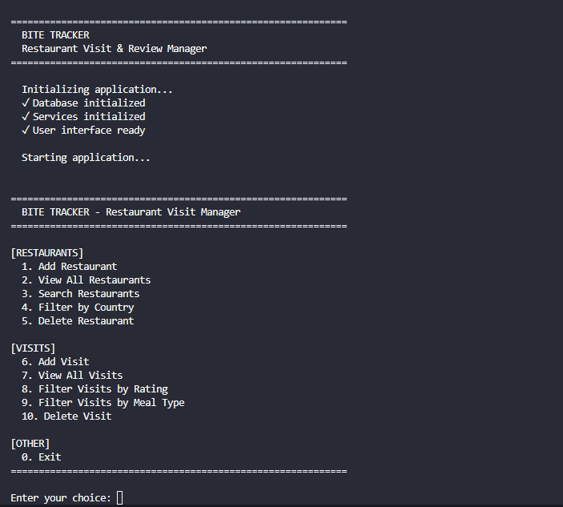

*Main menu with organized navigation*

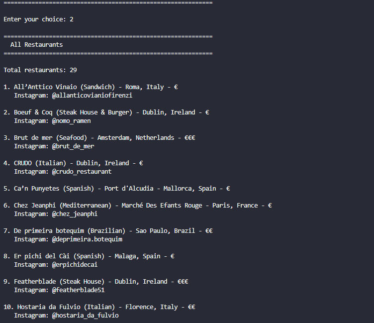

*Restaurant catalog with detailed information*

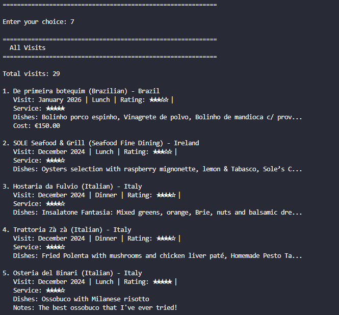

*Visit history with ratings and notes*

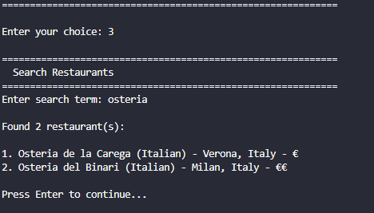

*Search restaurants by name with case-insensitive partial matching*

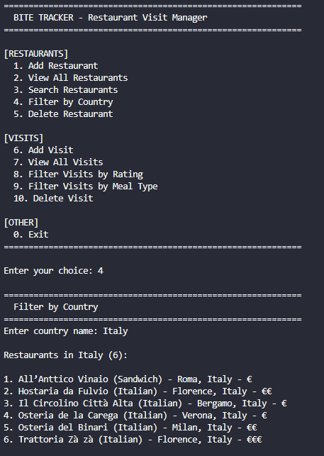

*Filter restaurants by location - showing Italian restaurants*

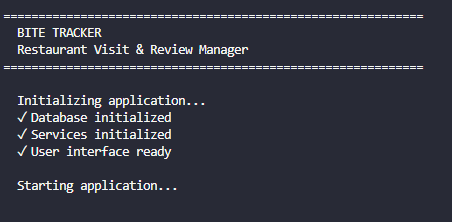

*Clean initialization with database setup and service layer loading*

### Live Heroku Deployment

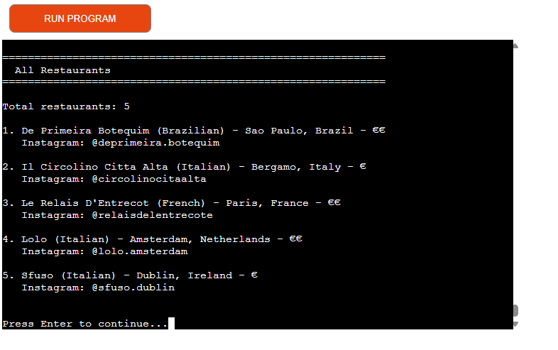

*Live deployment on Heroku showing restaurant catalog in browser terminal*

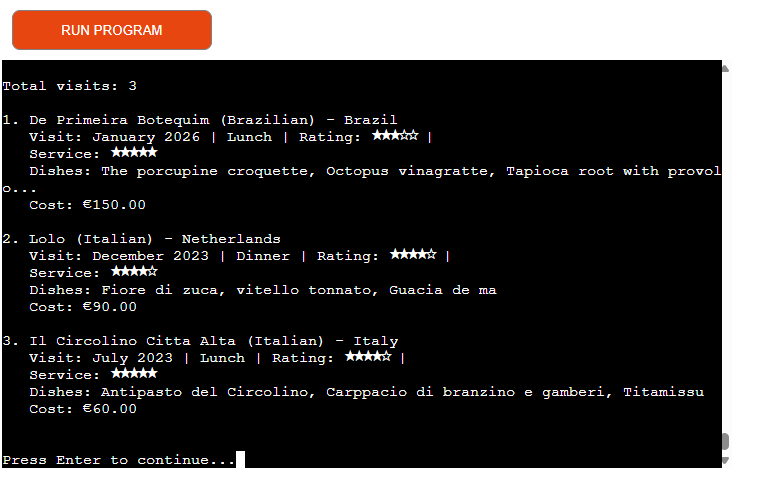

*Visit tracking functionality working on live Heroku deployment*

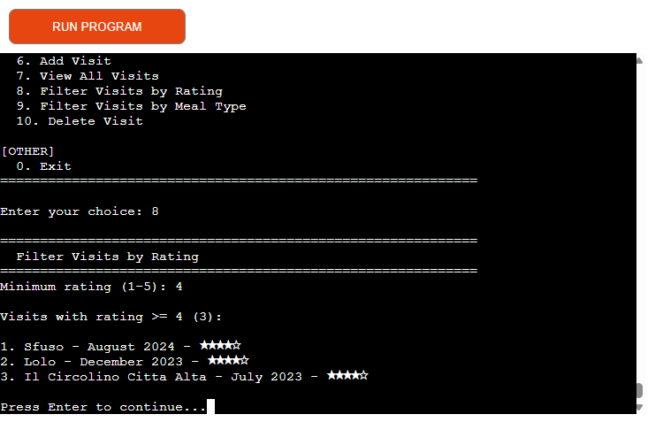

*Search functionality demonstrated on live Heroku instance*

---

## Features

### Restaurant Management

- **Add Restaurants** — Create restaurant entries with comprehensive details
- Name, location, and country
- Cuisine type and price range (€ to €€€€)
- Optional contact information (phone, website, social media)
- **View All Restaurants** — Display complete restaurant catalog with sorting
- **Search by Name** — Case-insensitive partial matching
- **Filter by Country** — Find restaurants by location
- **Delete Restaurants** — Remove entries with safety validation

### Visit Tracking

- **Add Visits** — Record detailed visit information
- Visit date (month/year tracking)
- Overall and service ratings (1-5 stars)
- Meal type (breakfast, lunch, dinner, brunch, other)
- Dishes ordered and recommended items
- Beverage selections
- Total cost tracking
- Personal notes and "would return" flag
- **View All Visits** — See complete visit history with restaurant details
- **Filter by Rating** — Find top-rated experiences
- **Filter by Meal Type** — Browse by dining occasion
- **Delete Visits** — Remove visit records

### Business Logic & Validation

- **1-to-1 Relationship Enforcement** — Each restaurant can have only one visit
- **Foreign Key Validation** — Visits must reference existing restaurants
- **Delete Protection** — Cannot delete restaurants with associated visits
- **Data Validation** — Comprehensive input validation at multiple layers
- Domain model validation (data integrity)
- Service layer validation (business rules)
- Input sanitization (user input)
- **Date Validation** — Prevents future dates, supports multiple formats
- **Smart Exit Messages** — Conditional feedback based on user actions

### User Experience

- **Intuitive Menu System** — Clear navigation with grouped options
- **Confirmation Prompts** — Prevents accidental deletions
- **Helpful Error Messages** — Clear feedback with actionable guidance
- **Progress Indicators** — Visual feedback during startup
- **Data Persistence** — All changes automatically saved to database

---

## Architecture

Bite Tracker implements a **clean, layered architecture** with strict separation of concerns. Each layer has a single responsibility and depends only on abstractions, not concrete implementations.

### Architectural Diagram

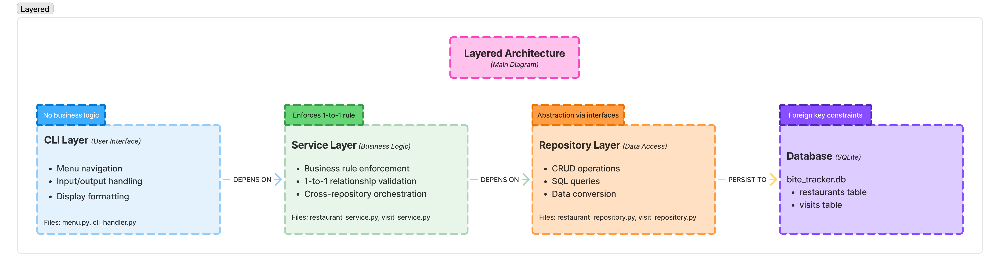
*Four-layer architecture with clear separation of concerns*

### Data Flow Example

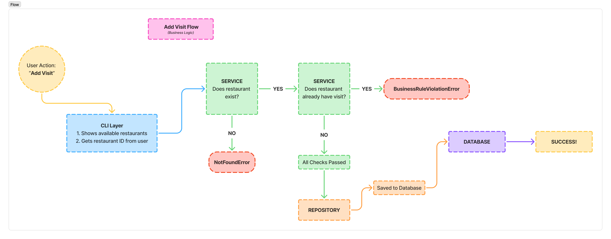
*Business rule enforcement when adding a visit*

### Entity Relationship Diagram

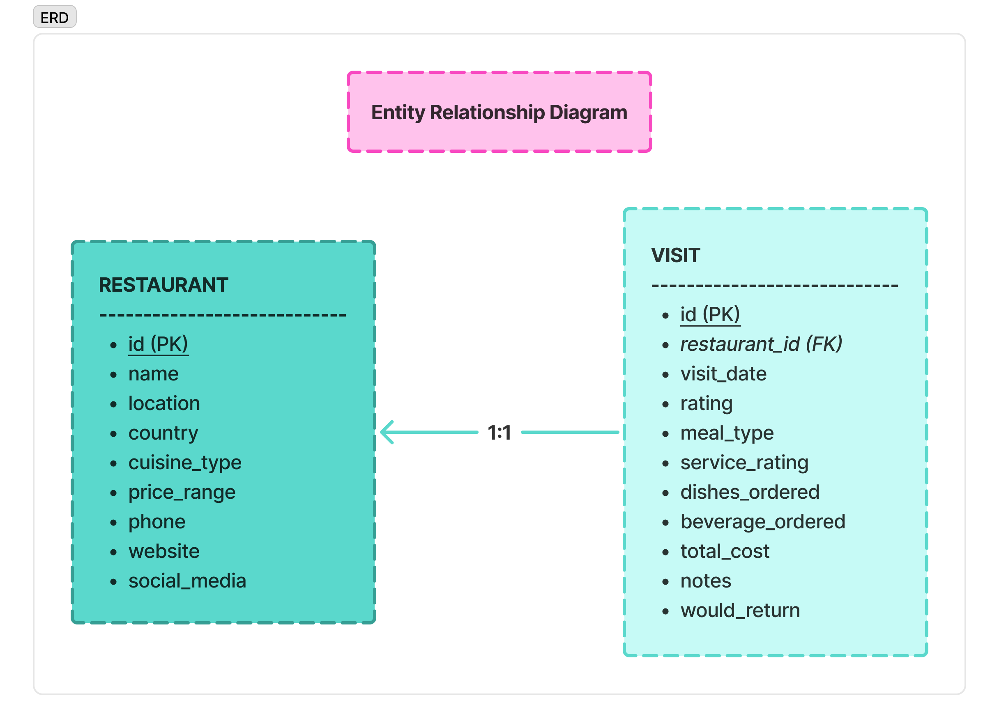
*Data model showing 1-to-1 restaurant-visit relationship*

### Layer Responsibilities

#### CLI Layer (`cli/`)

**Purpose:** Handles all user interaction

**Responsibilities:**
- Display menus and navigation
- Capture user input
- Display results and error messages
- Route commands to appropriate services

**Does NOT:**
- Contain business logic
- Access database directly
- Perform data validation (delegates to service layer)

**Key Files:**
- `menu.py` — Main menu system and navigation
- `cli_handler.py` — CLI operations for restaurants and visits

---

#### Service Layer (`services/`)

**Purpose:** Implements business logic and orchestrates operations

**Responsibilities:**
- Enforce business rules (e.g., 1-to-1 visit relationship)
- Coordinate multiple repositories when needed
- Validate business logic constraints
- Convert between domain models and presentation layer

**Does NOT:**
- Handle user input/output
- Know about database implementation details
- Contain SQL or file operations

**Key Files:**
- `restaurant_service.py` — Restaurant business logic
- `visit_service.py` — Visit business logic

**Example Business Rules Enforced:**
- Cannot create visit for non-existent restaurant
- Cannot create duplicate visit for same restaurant (1-to-1)
- Cannot delete restaurant if visit exists
- Cannot move visit to restaurant that already has one

---

#### Repository Layer (`repositories/`)

**Purpose:** Abstracts data access and persistence

**Responsibilities:**
- CRUD operations (Create, Read, Update, Delete)
- Database queries and data retrieval
- Convert between database rows and domain models
- Handle database connections and transactions

**Does NOT:**
- Enforce business rules
- Know about user interface
- Contain presentation logic

**Key Files:**
- `base.py` — Abstract repository interfaces
- `restaurant_repository.py` — SQLite implementation for restaurants
- `visit_repository.py` — SQLite implementation for visits

**Design Pattern:** Repository pattern with dependency inversion
- Services depend on repository abstractions (interfaces)
- Concrete SQLite implementation can be swapped without changing services

---

#### Domain Layer (`models/`)

**Purpose:** Core business entities and domain rules

**Responsibilities:**
- Define data structures
- Enforce domain invariants
- Validate data integrity
- Provide domain-specific methods

**Key Files:**
- `restaurant.py` — Restaurant entity with validation
- `visit.py` — Visit entity with validation

**Validation Approach:**
- Validation happens in `__post_init__()` automatically
- Impossible to create invalid domain objects
- Raises `ValidationError` with clear messages

---

### Design Principles Applied

#### SOLID Principles

**Single Responsibility Principle**
- Each class has one reason to change
- CLI handles UI, Service handles logic, Repository handles data

**Open/Closed Principle**
- Can extend functionality without modifying existing code
- New repositories can be added (e.g., JSON storage) without changing services

**Liskov Substitution Principle**
- Any repository implementation can replace another
- Services work with repository interfaces, not concrete classes

**Interface Segregation Principle**
- Repository interfaces define only necessary methods
- Clients don't depend on methods they don't use

**Dependency Inversion Principle**
- High-level modules (services) depend on abstractions (repository interfaces)
- Low-level modules (SQLite repositories) implement abstractions
- Dependencies are injected, not created

#### Additional Patterns

**Dependency Injection**
- Services receive repositories as constructor parameters
- Makes testing easier (can inject mock repositories)
- Loose coupling between layers

**Repository Pattern**
- Abstracts data source details
- Provides collection-like interface for domain objects
- Centralizes data access logic

**Exception Hierarchy**
- Custom exceptions for different error types
- Clear separation: `ValidationError`, `NotFoundError`, `BusinessRuleViolationError`
- Appropriate handling at each layer

---

## Technology Stack

### Core Technologies

- **Python 3.8+** — Primary programming language
- **SQLite3** — Embedded relational database (standard library)
- **Standard Library Only** — No external dependencies required

### Python Standard Library Modules Used
- `sqlite3` — Database operations
- `datetime` — Date handling and validation
- `dataclasses` — Clean domain model definitions
- `typing` — Type hints for better code clarity
- `abc` — Abstract base classes for interfaces
- `pathlib` — Cross-platform file path handling
- `json` — Data import functionality

### Development Tools
- **VS Code** — Primary IDE
- **Git** — Version control
- **Python Virtual Environment** — Dependency isolation

---

## Data Model

### Restaurant Entity

**Purpose:** Represents a restaurant with contact and classification details

**Fields:**
- `id` (Integer, Primary Key, Auto-increment) — Unique identifier
- `name` (Text, Required) — Restaurant name (max 100 chars)
- `location` (Text, Required) — Address or area (max 150 chars)
- `country` (Text, Required) — Country location (max 100 chars)
- `cuisine_type` (Text, Optional) — Type of cuisine (max 50 chars)
- `price_range` (Integer, Required) — 1=€, 2=€€, 3=€€€, 4=€€€€
- `phone` (Text, Optional) — Contact number (max 20 chars)
- `website` (Text, Optional) — Website URL (max 200 chars)
- `social_media` (Text, Optional) — Social media profile URL (max 200 chars)

**Validation Rules:**
- Name cannot be empty
- Location and country are required
- Price range must be 1-4
- All string fields are trimmed of whitespace

---

### Visit Entity

**Purpose:** Records a visit to a restaurant with review details

**Fields:**
- `id` (Integer, Primary Key, Auto-increment) — Unique identifier
- `restaurant_id` (Integer, Foreign Key, Required) — Links to restaurant
- `visit_date` (Date, Required) — Date of visit (stored as first day of month)
- `rating` (Integer, Required) — Overall rating (1-5 stars)
- `meal_type` (Text, Required) — breakfast/lunch/dinner/brunch/other
- `service_rating` (Integer, Optional) — Service quality (1-5 stars)
- `dishes_ordered` (Text, Optional) — Comma-separated list (max 2000 chars)
- `recommended_dishes` (Text, Optional) — Recommended items (max 500 chars)
- `beverage_ordered` (Text, Optional) — Beverages (max 2000 chars)
- `total_cost` (Real, Optional) — Total amount spent
- `notes` (Text, Optional) — Personal notes (max 1000 chars)
- `would_return` (Boolean, Default True) — Would visit again

**Validation Rules:**
- Restaurant ID must reference existing restaurant
- Visit date cannot be in the future
- Rating must be 1-5
- Meal type must be valid option
- Service rating (if provided) must be 1-5

**Business Rule:** Each restaurant can have only **one** visit (1-to-1 relationship)

---

### Database Schema

**SQLite Tables:**
```sql
CREATE TABLE restaurants (
    id INTEGER PRIMARY KEY AUTOINCREMENT,
    name TEXT NOT NULL,
    location TEXT NOT NULL,
    country TEXT NOT NULL,
    cuisine_type TEXT,
    price_range INTEGER NOT NULL,
    phone TEXT,
    website TEXT,
    social_media TEXT
);

CREATE TABLE visits (
    id INTEGER PRIMARY KEY AUTOINCREMENT,
    restaurant_id INTEGER NOT NULL,
    visit_date DATE NOT NULL,
    rating INTEGER NOT NULL,
    meal_type TEXT NOT NULL,
    service_rating INTEGER,
    dishes_ordered TEXT,
    recommended_dishes TEXT,
    beverage_ordered TEXT,
    total_cost REAL,
    notes TEXT,
    would_return INTEGER NOT NULL DEFAULT 1,
    FOREIGN KEY (restaurant_id) REFERENCES restaurants(id)
        ON DELETE CASCADE
);
```

**Foreign Key Constraint:**
- `ON DELETE CASCADE` — If restaurant is deleted, its visit is automatically deleted
- However, application enforces manual deletion (service layer prevents deleting restaurant with visit)

**Data Integrity:**
- Foreign key constraints enabled (`PRAGMA foreign_keys = ON`)
- Primary keys auto-increment
- NOT NULL constraints on required fields
- Default values where appropriate

---

## Installation & Setup

### Prerequisites

- Python 3.8 or higher
- No external dependencies required (uses Python standard library only)

### Installation Steps

1. **Clone or download the project**
```bash
git clone https://github.com/crucioltheresa/bite-tracker
cd bite-tracker
```

2. **Create virtual environment (recommended)**
```bash
python -m venv venv
```

3. **Activate virtual environment**

**Windows:**
```bash
venv\Scripts\activate
```

**macOS/Linux:**
```bash
source venv/bin/activate
```

4. **Verify installation**
```bash
python --version
# Should show Python 3.8 or higher
```

5. **Run the application**
```bash
python run.py
```

The application will automatically:
- Create the `data/` directory if it doesn't exist
- Initialize the SQLite database (`bite_tracker.db`)
- Create necessary tables
- Launch the main menu

---

## Usage Guide

### Starting the Application

Run the application from the project root:
```bash
python run.py
```

You'll see the startup sequence:

```text
============================================================
BITE TRACKER
Restaurant Visit & Review Manager
============================================================

Initializing application...
✓ Database initialized
✓ Services initialized
✓ User interface ready

Starting application...
```

### Main Menu

The main menu provides organized access to all features:

```text
============================================================
BITE TRACKER - Restaurant Visit Manager
============================================================

[RESTAURANTS]
1. Add Restaurant
2. View All Restaurants
3. Search Restaurants
4. Filter by Country
5. Delete Restaurant

[VISITS]
6. Add Visit
7. View All Visits
8. Filter Visits by Rating
9. Filter Visits by Meal Type
10. Delete Visit

[OTHER]
0. Exit
============================================================
```

### Common Workflows

#### Adding Your First Restaurant

1. Select option **1** (Add Restaurant)
2. Enter required information:
- Restaurant name
- Location (city/address)
- Country
- Price range (1-4)
3. Enter optional information (or press Enter to skip):
- Cuisine type
- Phone number
- Website
- Social media profile
4. Confirmation message appears with assigned ID

**Example:**

```text
Restaurant name: Osteria Francescana
Location (city/address): Modena
Country: Italy
Price range (1=€, 2=€€, 3=€€€, 4=€€€€): 4
Cuisine type (optional, press Enter to skip): Italian Fine Dining
Phone (optional):
Website (optional):
Social media (optional): instagram.com/osteriafrancescana

✓ Restaurant 'Osteria Francescana' added successfully! (ID: 1)
```

---

#### Recording a Visit

1. Select option **6** (Add Visit)
2. View list of available restaurants (shows which have visits)
3. Enter restaurant ID
4. Enter visit details:
- Visit date (formats: YYYY-MM-DD, DD/MM/YYYY, DD-MM-YYYY)
- Overall rating (1-5)
- Meal type (breakfast/lunch/dinner/brunch/other)
5. Enter optional details (or press Enter to skip):
- Service rating (1-5)
- Dishes ordered
- Recommended dishes
- Beverages
- Total cost
- Notes
- Would you return (yes/no, default yes)

**Example:**

```text
Available restaurants:
1. Osteria Francescana (ID: 1)
2. Noma (ID: 2) [HAS VISIT]

Enter restaurant ID: 1

Visit Details:
Visit date (YYYY-MM-DD, DD/MM/YYYY, or DD-MM-YYYY): 2024-03-15
Overall rating (1-5): 5
Meal type (breakfast/lunch/dinner/brunch/other): dinner

Optional Details (press Enter to skip):
Service rating (1-5): 5
Dishes ordered: Tasting Menu, Five Ages of Parmigiano
Recommended dishes: Memory of a Mortadella Sandwich
Beverages: Wine Pairing
Total cost (€): 350
Notes: Absolutely incredible. Best meal of my life.
Would you return? (yes/no, default yes): yes

✓ Visit added successfully! (ID: 1)
```

---

#### Searching & Filtering

**Search by Restaurant Name:**
- Select option **3**
- Enter search term (case-insensitive, partial matching)
- Example: Search "pasta" finds "Pasta Palace", "Best Pasta", etc.

**Filter by Country:**
- Select option **4**
- Enter country name
- Shows all restaurants in that country

**Filter Visits by Rating:**
- Select option **8**
- Enter minimum rating (1-5)
- Example: Enter "5" to see only 5-star experiences

**Filter Visits by Meal Type:**
- Select option **9**
- Choose: breakfast, lunch, dinner, brunch, or other
- Shows all visits of that type

---

#### Viewing Data

**View All Restaurants:**
- Select option **2**
- Displays complete list with details:

```text
1. Osteria Francescana (Italian Fine Dining) - Modena, Italy - €€€€
    Phone: +39 123 456789
    Social: instagram.com/osteriafrancescana
```

**View All Visits:**
- Select option **7**
- Shows visits with restaurant context:

```text
1. Osteria Francescana (Italian Fine Dining) - Italy
    Visit: March 2024 | Dinner | Rating: ★★★★★
    Service: ★★★★★
    Dishes: Tasting Menu, Five Ages of Parmigiano
    Cost: €350.00
    Notes: Absolutely incredible. Best meal of my life.
```

---

#### Deleting Data

**Delete a Visit:**
1. Select option **10**
2. View list of visits with IDs
3. Enter visit ID to delete
4. Confirm with "yes"

**Delete a Restaurant:**
1. Select option **5**
2. View list of restaurants with IDs
3. Enter restaurant ID to delete
4. Confirm with "yes"

**Important:** Cannot delete a restaurant that has a visit. Delete the visit first.

---

### Importing Bulk Data (Optional)

If you have existing restaurant data, you can import it using the provided script:

1. **Create/edit `my_restaurants.json`** with your data (see `import_data.py` for format)
2. **Run the import script:**
```bash
python import_data.py
```
3. **Verify imported data:**
```bash
python run.py
# Then select option 2 to view all restaurants
```

---

### Exiting the Application

- Select option **0** (Exit)
- Application shows farewell message:
- If you made changes: "Your changes have been saved."
- If you only browsed: "Come back soon to track more visits!"
- All data is automatically persisted to the database

---

### Data Location

All application data is stored in:

```text
data/bite_tracker.db
```

**To backup your data:** Simply copy this file
**To reset:** Delete this file (will be recreated on next run)
**To transfer:** Copy this file to another installation

---

---

## Live Deployment

### Heroku Demo

**🌐 [Live Application on Heroku](https://bite-tracker-2800389c963c.herokuapp.com/)**

The application is deployed on Heroku and accessible via a browser-based terminal interface. The live demo includes sample data demonstrating all features.

**Try it now:**
1. Click the link above
2. Wait for the terminal to load (may take a few seconds on first visit)
3. Navigate using the numbered menu options
4. Test adding restaurants, recording visits, and searching

---

### Deployment Notes

**Technology:**
- Deployed using Heroku's Python and Node.js buildpacks
- Browser terminal provided by Code Institute's Python template
- Allows CLI interaction through web interface

**Data Persistence:**
Due to Heroku's ephemeral filesystem, the SQLite database resets when the dyno restarts (typically every 24 hours or on redeployment). This is a known limitation of SQLite on Heroku.

**Live Demo Data:**
- Sample restaurants and visits are pre-loaded for demonstration
- You can add your own test data through the interface
- Data will persist during your session but may reset later

**Full Dataset:**
The complete collection of 25+ restaurants with detailed visit records is available when running locally:
```bash
git clone <repository-url>
cd bite-tracker
python import_data.py
python run.py
```

**Production Considerations:**
For a production deployment requiring persistent data, the application would need:
- Migration to PostgreSQL (Heroku Postgres addon)
- Or deployment to a platform with persistent storage
- Database migration scripts to preserve data

This limitation is acceptable for educational/portfolio projects and does not affect the demonstration of the application's architecture and functionality.

---

## Design Decisions

### 1-to-1 Restaurant-Visit Relationship

**Decision:** Each restaurant can have only one visit record.

**Rationale:**
- Simplified data model for initial implementation
- Focus on "latest experience" tracking
- Reduces complexity in business logic
- Users can update existing visit rather than creating duplicates

**Implementation:**
- Enforced at service layer before database insertion
- Clear error messages guide users to correct workflow
- Prevents data inconsistency

**Trade-off:** Cannot track visit history or progression over time. This limitation is documented as a future enhancement (see below).

---

### Month/Year Visit Date Storage

**Decision:** Visit dates are stored as the first day of the month (e.g., March 2024 → 2024-03-01).

**Rationale:**
- Users typically remember "I went there in March" rather than exact dates
- Simplifies user input (fewer details to remember)
- Sufficient granularity for tracking dining experiences
- Still maintains proper date data type for querying and sorting

**Implementation:**
- Stored as proper `DATE` type in database
- Displayed as "Month Year" in CLI
- User input accepts multiple formats (YYYY-MM-DD, DD/MM/YYYY, DD-MM-YYYY)

**Trade-off:** Cannot track multiple visits in the same month. Acceptable given the 1-to-1 relationship design.

---

### No Update Functionality in CLI

**Decision:** Update operations are not exposed in the CLI interface.

**Rationale:**
- Time management and scope control for project deadline
- Update logic exists and is fully implemented in service and repository layers
- Demonstrates complete architecture even for unimplemented features
- Delete + re-add provides workable alternative for users

**Current Workaround:** Users can delete and recreate entries with corrected information.

**Future Enhancement:** Full update UI is documented as a planned feature (see Future Enhancements).

**Architecture Note:** This demonstrates forward-thinking design—the infrastructure supports updates; only the user interface needs to be added.

---

### Repository Pattern with Dependency Inversion

**Decision:** Services depend on abstract repository interfaces, not concrete implementations.

**Rationale:**
- **Testability:** Can inject mock repositories for unit testing
- **Flexibility:** Easy to swap SQLite for different storage (JSON, PostgreSQL, etc.)
- **SOLID Principles:** Follows Dependency Inversion Principle
- **Professional Pattern:** Industry-standard approach to data access

**Implementation:**
- Abstract base classes define repository contracts (`repositories/base.py`)
- Concrete SQLite implementations (`SqliteRestaurantRepository`, `SqliteVisitRepository`)
- Services receive repositories via constructor injection

**Benefit:** Can add new storage backends without modifying service layer.

---

### Validation Strategy: Multi-Layer

**Decision:** Validation occurs at three separate layers.

**Layers:**
1. **Input Validation** (`validators/`) — Sanitizes user input, checks formats
2. **Domain Validation** (`models/`) — Enforces domain rules and data integrity
3. **Service Validation** (`services/`) — Enforces business rules and cross-entity constraints

**Rationale:**
- **Defense in depth:** Multiple validation points catch different error types
- **Clear separation:** Each layer validates its own concerns
- **Better error messages:** Can provide context-specific feedback
- **Fail fast:** Invalid data caught as early as possible

**Example Flow:**
```
User input "abc" for rating
→ Input validator converts to int (fails) → ValidationError
→ User sees: "Rating must be a number between 1 and 5"

User input "6" for rating
→ Input validator accepts (is a number)
→ Domain model validates range (fails) → ValidationError
→ User sees: "Rating must be between 1 and 5"
```

---

### Exception Hierarchy

**Decision:** Custom exception types rather than generic Python exceptions.

**Exception Types:**
- `BiteTrackerError` — Base class for all application errors
- `ValidationError` — Input/data validation failures
- `NotFoundError` — Entity doesn't exist
- `BusinessRuleViolationError` — Business logic constraints violated
- `RepositoryError` — Database operation failures

**Rationale:**
- **Specific handling:** Different exceptions can be caught and handled appropriately
- **Clear intent:** Exception name explains what went wrong
- **Better debugging:** Stack traces show domain-specific error types
- **User-friendly:** Can provide targeted error messages

**Example:**
```python
try:
    visit_service.create_visit(...)
except NotFoundError:
    # Restaurant doesn't exist
    print("Restaurant not found")
except BusinessRuleViolationError:
    # Restaurant already has a visit
    print("Restaurant already reviewed")
```

---

### SQLite Over Other Storage Options

**Decision:** Use SQLite for data persistence rather than CSV or JSON files.

**Rationale:**
- **Relational data:** Natural fit for restaurant-visit relationships
- **Foreign keys:** Built-in referential integrity
- **No parsing:** Direct SQL queries vs manual file parsing
- **ACID properties:** Transactions ensure data consistency
- **Standard library:** No external dependencies needed
- **Scalability:** Can handle thousands of entries efficiently

**Trade-offs:**
- **Complexity:** Slightly more complex than flat files
- **Portability:** Binary file format (but SQLite is universal)

**Benefits outweigh drawbacks:** Professional database with zero installation overhead.

---

### Smart Exit Messages

**Decision:** Conditional exit messages based on user activity.

**Implementation:**
- Tracks whether data was modified during session
- Shows "Your changes have been saved" if user added/deleted data
- Shows "Come back soon to track more visits!" if user only browsed

**Rationale:**
- **Accuracy:** Don't claim data was saved if nothing changed
- **User confidence:** Confirms actions were persisted when appropriate
- **Professional UX:** Attention to small details improves experience

**Simple but effective:** Small touch that demonstrates user-centered thinking.

---

## Future Enhancements

### Planned Features

#### 1. Update Functionality (High Priority)

**Description:** Add CLI options to edit existing restaurants and visits in-place.

**Current State:**
- Service and repository layers fully support updates
- Only CLI interface needs to be implemented

**Implementation Plan:**
- Menu options 11 (Update Restaurant) and 12 (Update Visit)
- Show current values, allow user to change only desired fields
- "Press Enter to keep current value" pattern for each field

**Benefit:** More convenient than delete + re-add workflow.

---

#### 2. Multiple Visits Per Restaurant (Medium Priority)

**Description:** Expand from 1-to-1 to 1-to-many relationship.

**Changes Required:**
- Modify service layer business rules
- Update `get_by_restaurant_id()` to return list instead of single visit
- Add visit history view in CLI
- Track visit progression over time

**Benefit:** See how restaurant experiences change over time, compare multiple visits.

---

#### 3. Photo Attachments (Medium Priority)

**Description:** Store and display photos of dishes.

**Implementation Plan:**
- Add `photos` field to Visit model (store file paths or filenames)
- Create `photos/` directory for image storage
- Link visit records to image files
- Optional: Display in CLI using ASCII art or external viewer

**Benefit:** Visual memory aid, richer documentation of experiences.

---

#### 4. Advanced Filtering & Sorting (Low Priority)

**Description:** More sophisticated search and filter options.

**Planned Features:**
- Filter by price range
- Filter by date range
- Sort by rating, date, cost
- Combined filters (e.g., "Italian restaurants in Dublin with 5-star rating")
- Save favorite filters

**Benefit:** Easier to find specific restaurants or visits.

---

#### 5. Export Functionality (Low Priority)

**Description:** Export data to various formats for sharing or backup.

**Export Formats:**
- CSV (spreadsheet-compatible)
- JSON (machine-readable)
- PDF report (printable restaurant guide)
- HTML (shareable web page)

**Use Cases:**
- Share recommendations with friends
- Create printed restaurant guide
- Backup data in portable format

---

#### 6. Statistics & Insights (Low Priority)

**Description:** Analytics dashboard showing dining patterns.

**Metrics:**
- Most visited countries/cuisines
- Average rating by price range
- Spending patterns over time
- Favorite meal types
- "Would return" percentage

**Benefit:** Discover personal dining preferences and trends.

---

#### 7. Import from Other Sources (Low Priority)

**Description:** Import restaurant data from popular platforms.

**Potential Sources:**
- Google Maps saved places
- Yelp bookmarks
- TripAdvisor lists
- Instagram location tags

**Benefit:** Quickly populate database from existing data.

---

### Technical Improvements

#### Unit Testing

- Comprehensive test coverage for models, services, repositories
- Mock repositories for service layer testing
- Pytest framework with coverage reports

#### Enhanced Error Recovery

- Automatic database backup before destructive operations
- "Undo" functionality for recent deletions
- Data integrity checks on startup

#### Performance Optimization

- Database indexing for faster searches
- Query optimization for large datasets
- Caching frequently accessed data

#### Internationalization

- Support for multiple languages
- Currency conversion for costs
- Date format preferences

---

## Project Structure

```
bite-tracker/
│
├── data/                           # Database storage
│   └── bite_tracker.db            # SQLite database (auto-created)
│
├── models/                         # Domain layer
│   ├── __init__.py
│   ├── restaurant.py              # Restaurant entity with validation
│   └── visit.py                   # Visit entity with validation
│
├── repositories/                   # Data access layer
│   ├── __init__.py
│   ├── base.py                    # Abstract repository interfaces
│   ├── restaurant_repository.py   # SQLite implementation for restaurants
│   └── visit_repository.py        # SQLite implementation for visits
│
├── services/                       # Business logic layer
│   ├── __init__.py
│   ├── restaurant_service.py      # Restaurant business logic
│   └── visit_service.py           # Visit business logic
│
├── validators/                     # Input validation
│   ├── __init__.py
│   └── input_validator.py         # User input validation and parsing
│
├── cli/                            # Presentation layer
│   ├── __init__.py
│   ├── menu.py                    # Main menu system
│   └── cli_handler.py             # CLI operations handler
│
├── exceptions/                     # Custom exception hierarchy
│   ├── __init__.py
│   └── exceptions.py              # Application-specific exceptions
│
├── run.py                          # Application entry point
├── import_data.py                  # Optional: Bulk data import script
├── my_restaurants.json             # Optional: Data import template
│
├── requirements.txt                # Python dependencies (none required)
├── runtime.txt                     # Python version specification
├── README.md                       # This file
└── .gitignore                      # Git ignore rules
```

### Directory Responsibilities

**`models/`** — Domain entities
- Pure Python classes representing business concepts
- Self-validating (validation in `__post_init__`)
- No dependencies on other layers
- Can be used independently

**`repositories/`** — Data persistence
- Abstract interfaces define contracts
- SQLite implementations handle database operations
- Converts between database rows and domain models
- Only layer that knows about database

**`services/`** — Business logic
- Enforces business rules
- Orchestrates multiple repositories
- Validates cross-entity constraints
- Bridge between CLI and data layers

**`validators/`** — Input sanitization
- Parses and validates user input
- Converts strings to appropriate types
- Separate from domain validation
- Reusable validation utilities

**`cli/`** — User interface
- Menu navigation and display
- User input/output handling
- No business logic
- Routes commands to services

**`exceptions/`** — Error handling
- Custom exception types
- Clear error messaging
- Hierarchical structure
- Domain-specific errors

---

## Testing

### Current Testing Approach

**Manual Testing:**
- Comprehensive manual testing of all features
- Real-world usage scenarios validated
- Business rules verified through user workflows
- Data persistence tested across sessions

**Test Coverage Areas:**
- ✅ Restaurant CRUD operations
- ✅ Visit CRUD operations
- ✅ Search and filter functionality
- ✅ Business rule enforcement (1-to-1 relationship)
- ✅ Delete protection (restaurant with visit)
- ✅ Input validation (dates, ratings, meal types)
- ✅ Data persistence and retrieval
- ✅ Error handling and user feedback

### Future Testing Enhancements

**Unit Testing** (Planned):
```python
# Example unit test structure
def test_restaurant_creation():
    """Test restaurant with valid data creates successfully."""
    restaurant = Restaurant(
        name="Test Restaurant",
        location="Dublin",
        country="Ireland",
        price_range=2
    )
    assert restaurant.name == "Test Restaurant"
    assert restaurant.price_range == 2

def test_visit_business_rule():
    """Test cannot create duplicate visit for same restaurant."""
    # Mock repository that already has visit
    # Verify BusinessRuleViolationError is raised
```

**Integration Testing** (Planned):
- Test complete workflows end-to-end
- Verify layer interactions
- Database operations with test data

**Test Framework:**
- `pytest` for test execution
- `pytest-cov` for coverage reports
- Mock repositories for isolated testing

---

## Development Process

### Version Control

- Git for version control
- Regular commits with descriptive messages
- Branching strategy for features (if expanded)

### Code Quality

- PEP 8 style guidelines followed
- Type hints for clarity and IDE support
- Comprehensive docstrings
- Consistent naming conventions

### Documentation

- Inline comments for complex logic
- Module-level docstrings
- Function/method documentation
- Architectural documentation (this README)

---

## Lessons Learned

### Technical Insights

- **Layered architecture reduces complexity** — Each layer has clear responsibility
- **Dependency injection improves testability** — Services can work with any repository implementation
- **Custom exceptions enhance debugging** — Domain-specific errors are easier to trace
- **Validation at multiple layers catches different errors** — Defense in depth approach

### Design Insights

- **Start with data model** — Clear entities make architecture decisions easier
- **Abstract before implementing** — Repository interfaces defined before SQLite implementation
- **Business rules in service layer** — Keeps logic centralized and consistent
- **User experience matters** — Small touches (smart exit messages, confirmation prompts) improve quality

### Project Management

- **Scope control is critical** — Deferred update feature to maintain quality on other features
- **Iterate and refine** — Built layer by layer, testing as we go
- **Document as you build** — README written alongside code, not after

---

## Credits & Acknowledgments

### Developer

**Maria Theresa Cruciol Cavalcanti**  
Code Institute Student  
Portfolio Project 3 — Python Essentials

### Technologies

- **Python** — Programming language
- **SQLite** — Database engine
- **VS Code** — Development environment

### Educational Institution

**Code Institute**  
Full Stack Software Development Program

### Resources

- Python Official Documentation
- SQLite Documentation
- PEP 8 — Style Guide for Python Code
- Clean Architecture principles (Robert C. Martin)
- SOLID design principles

---
